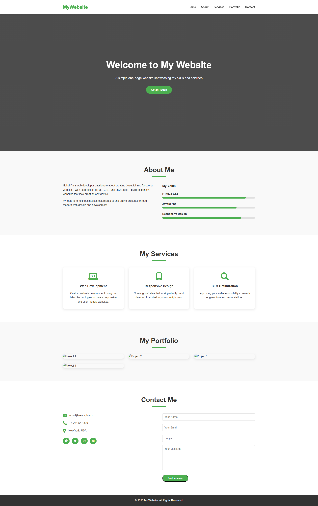

# One-Page Website

A simple, responsive one-page website template built with HTML and CSS.

## Features

- Fully responsive design that works on all devices
- Modern and clean UI
- Smooth scrolling navigation
- Skills section with progress bars
- Services section with hover effects
- Portfolio section with image overlays
- Contact form
- Social media links
- Font Awesome icons integration

## Sections

1. **Header** - Navigation menu with links to all sections
2. **Hero** - Welcome section with a call-to-action button
3. **About** - Information about the person/company with skills display
4. **Services** - Services offered with icons and descriptions
5. **Portfolio** - Portfolio showcase with project images and overlays
6. **Contact** - Contact information and form
7. **Footer** - Copyright information

## Technologies Used

- HTML5
- CSS3
- Font Awesome (for icons)
- Google Fonts

## How to Use

1. Clone or download this repository
2. Open `index.html` in your browser
3. Customize the content and styling to fit your needs

## Customization

- Change colors by modifying the CSS variables
- Replace placeholder images with your own
- Update text content in the HTML file
- Add or remove sections as needed

## License

This project is open source and available under the [MIT License](LICENSE).

## Preview

## Credits

- Placeholder images from [Placeholder.com](https://placeholder.com)
- Background image from [Unsplash](https://unsplash.com)
- Icons from [Font Awesome](https://fontawesome.com) 
